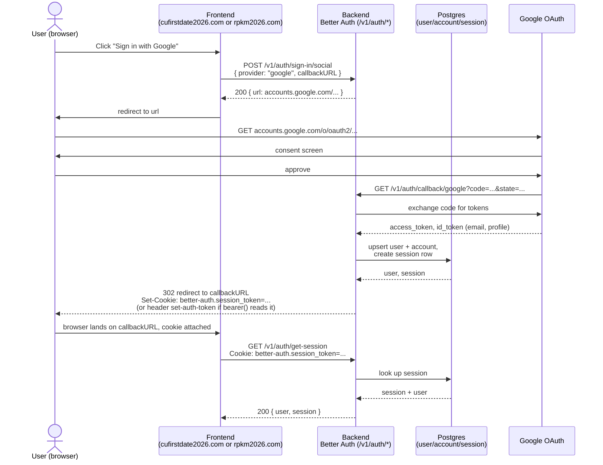

# Google sign-in — sequence diagram

Two frontends (`cufirstdate2026.com`, `rpkm2026.com`) share one Better Auth
backend. Google OAuth app config must list this backend's `/v1/auth/callback/google`
as an authorized redirect URI (one backend, one Google client, works for both
frontends since the return trip goes through the shared backend, not Google
directly to the frontend).

## Notes

- **Cross-origin cookies**: since the callback's final redirect lands back on
  the frontend's own origin, and the frontend then calls the backend
  cross-origin for `/get-session`, the cookie must be sent with
  `credentials: "include"`, and the frontend's origin must be in
  `trustedOrigins` on the backend (see [overview.md](./overview.md)).
- **Bearer alternative**: if cookies are unusable (e.g. no reliable third-party
  cookie support), read `set-auth-token` from the redirect response headers
  instead and store it client-side, then send `Authorization: Bearer <token>`
  on later requests. Requires `bearer()` plugin (already enabled).
- **Account linking**: same Google account signing into both
  `cufirstdate2026.com` and `rpkm2026.com` flows creates two independent
  `session` rows against the same `user`/`account` row — the user identity
  is shared, sessions are per-origin.
