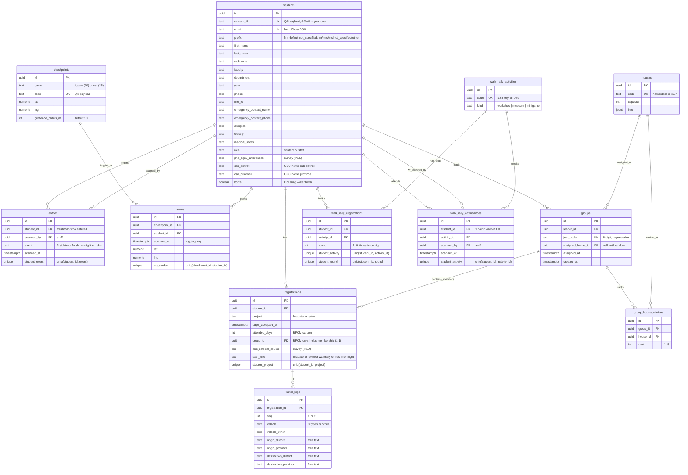
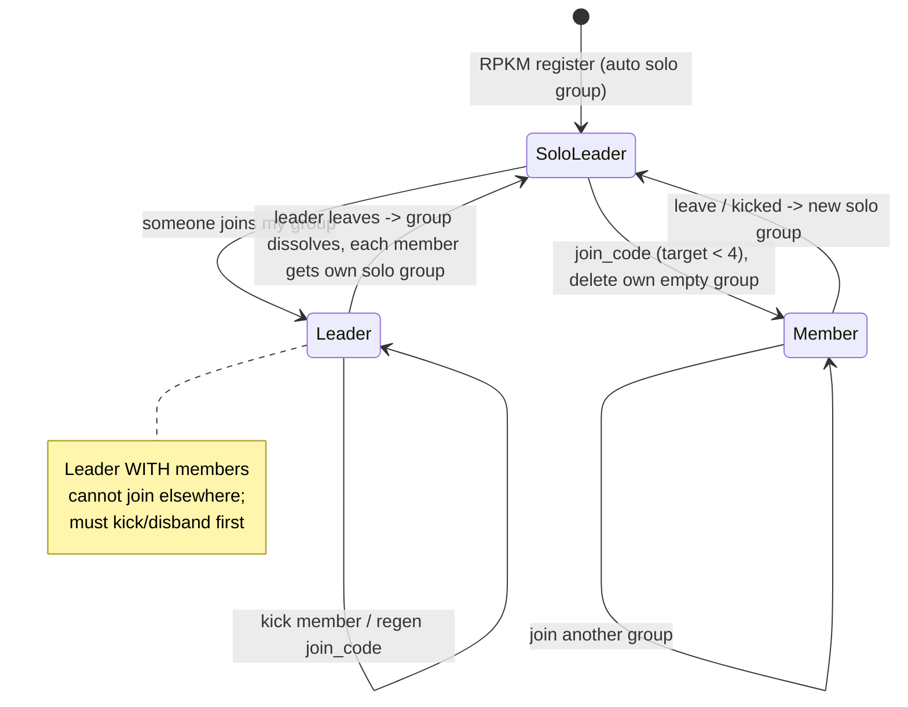
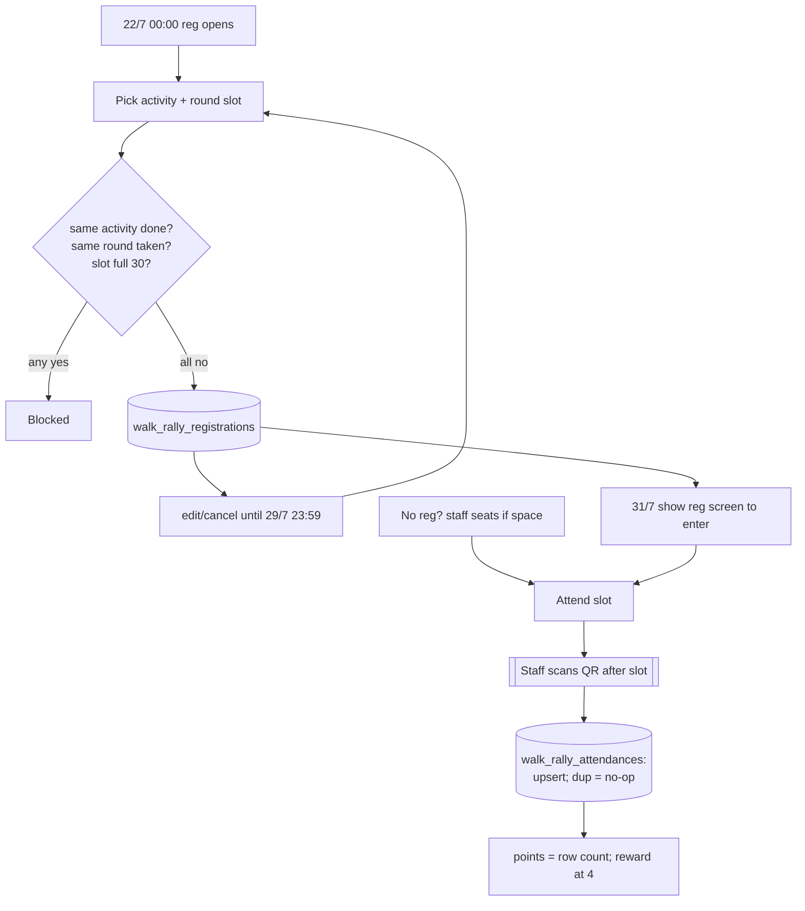
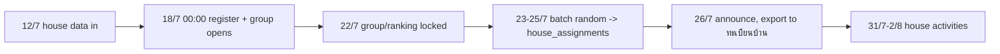

# FD × RPKM — Diagrams

## 1. ER diagram (schema)

> Every table also has `created_at` + `updated_at`. See `schema.dbml` for the authoritative version.



## 2. User flow (journey)

```mermaid
flowchart TD
    subgraph AUTH [Entry & registration - shared]
        direction TB
        FDsite([FD website]):::fd --> SSO
        RPKMsite([RPKM website]):::rpkm --> SSO
        SSO[Chula SSO] --> Upsert[Upsert students by email]
        Upsert --> Reg{Registered<br/>THIS site?}
        Reg -- yes --> Home[Site home]
        Reg -- no --> Form[Registration page<br/>prefill if other site done<br/>+ travel method + PDPA]
        Form --> InsReg[Insert registrations]
        InsReg --> Home
    end

    Home --> FDhome
    Home --> RPKMhome

    subgraph FD [FirstDate]
        direction TB
        FDhome[FD activities]:::fd --> MyQR[My QR = student_id]
        MyQR --> StaffScan[[Staff scans at event]]
        StaffScan --> Att[(entries:<br/>firstdate | freshmennight | rpkm)]
    end

    subgraph RPKM [RPKM]
        direction TB
        RPKMhome[RPKM activities]:::rpkm --> Houses[Houses - see state machine]
        RPKMhome --> Game{Game:<br/>year-one + in window?}
        Game -- no --> Disabled[Disabled]
        Game -- yes --> ScanQR[Scan static QR]
        ScanQR --> GPSgate{require_gps?}
        GPSgate -- yes --> CheckGPS{within<br/>geofence?}
        CheckGPS -- no --> Reject[Reject]
        CheckGPS -- yes --> Credit[(scans:<br/>dedupe + timestamp)]
        GPSgate -- no --> Credit
        RPKMhome --> StaticForm{Static<br/>in window?}
        StaticForm -- yes --> GGForm[Open form_url]
        StaticForm -- no --> Disabled
    end

    classDef fd fill:#ffe0e6,stroke:#cc3355;
    classDef rpkm fill:#e0ecff,stroke:#3355cc;
```

> RPKM registration also auto-creates the student's solo group (see state machine §3).

## 3. Group state machine (one student's group membership)



## Walk rally flow (31/7, reg 22/7–29/7)



> Registration counts exported to walk-rally team 30/7; attendance dump after the event.

## RPKM houses timeline


